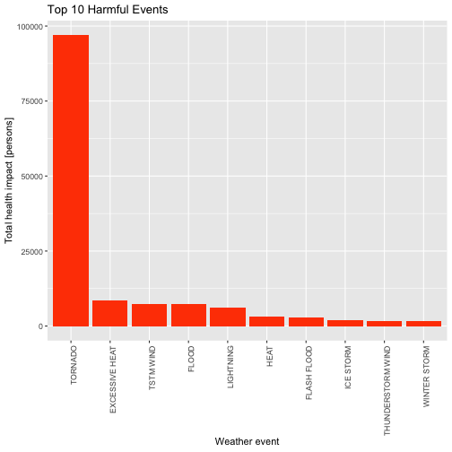
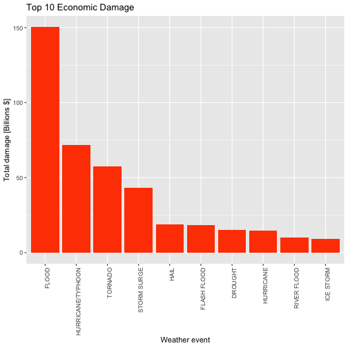

## Synopsis

 This project involves exploring the U.S. National Oceanic and Atmospheric Administration's (NOAA) storm database. And analyse these to address the following questions:
- Across the United States, which types of events  are most harmful with respect to population health?
- Across the United States, which types of events have the greatest economic consequences?

## Data Source

 This database tracks characteristics of major storms and weather events in the United States, including when and where they occur, as well as estimates of any fatalities, injuries, and property damage.

[Storm Data](https://d396qusza40orc.cloudfront.net/repdata%2Fdata%2FStormData.csv.bz2) [Mirror Site]

The events in the database start in the year 1950 and end in November 2011. In the earlier years of the database there are generally fewer events recorded, most likely due to a lack of good records. More recent years should be considered more complete.

## Data Processing

### Load Packages

Setup **dpyr** package for Cleaning, Processing, and Manipulating data.


```r
library(dplyr)
library(ggplot2)
```

### Download Data

Download the data from the NOAA database.


```r
download.file("https://d396qusza40orc.cloudfront.net/repdata%2Fdata%2FStormData.csv.bz2", destfile = "repdata-data-StormData.csv.bz2")
```

### Read Data

Load dataset into R.


```r
stormData <- read.csv("repdata-data-StormData.csv.bz2", header = TRUE, stringsAsFactors = FALSE)
```

Any columns that will not be needed for the final analysis will be removed to make the dataset a little smaller.


```r
extractData <- stormData %>%
        select(EVTYPE, FATALITIES, INJURIES, PROPDMG, PROPDMGEXP, CROPDMG, CROPDMGEXP)
```

Subsets the original a data frame returning the following components:


```r
str(extractData)
```

```
## 'data.frame':	902297 obs. of  7 variables:
##  $ EVTYPE    : chr  "TORNADO" "TORNADO" "TORNADO" "TORNADO" ...
##  $ FATALITIES: num  0 0 0 0 0 0 0 0 1 0 ...
##  $ INJURIES  : num  15 0 2 2 2 6 1 0 14 0 ...
##  $ PROPDMG   : num  25 2.5 25 2.5 2.5 2.5 2.5 2.5 25 25 ...
##  $ PROPDMGEXP: chr  "K" "K" "K" "K" ...
##  $ CROPDMG   : num  0 0 0 0 0 0 0 0 0 0 ...
##  $ CROPDMGEXP: chr  "" "" "" "" ...
```

In this dataset, there are some messy data:


```r
table(extractData$PROPDMGEXP)
```

```
## 
##             -      ?      +      0      1      2      3      4      5 
## 465934      1      8      5    216     25     13      4      4     28 
##      6      7      8      B      h      H      K      m      M 
##      4      5      1     40      1      6 424665      7  11330
```


```r
table(extractData$CROPDMGEXP)
```

```
## 
##             ?      0      2      B      k      K      m      M 
## 618413      7     19      1      9     21 281832      1   1994
```

So, clean up **CROPDMGEXP** and **PROPDMGEXP** with new exponet function:


```r
alphabeticalExp <- function(vec) {
        mapply(function(alphabet) {
                ifelse(alphabet == "",
                       10^0, # 1
                       switch(tolower(alphabet),
                              "h" = 10^2, # hundred
                              "k" = 10^3, # thouzand
                              "m" = 10^6, # million
                              "b" = 10^9, # billion
                              "+" = 10^0, # 1
                              "-" = 10^0, # 1
                              "?" = 10^0, # 1
                              " " = 10^0, # 1
                              10^as.integer(alphabet)))
        }, vec)
}
```


Top 10 harmful event:


```r
humanImpactTop10 <- extractData %>%
        # fatalities and injuries
        mutate(PERSONS = FATALITIES + INJURIES) %>%
        select(EVTYPE, PERSONS) %>%
        # summarize each event type
        group_by(EVTYPE) %>%
        summarize_all(sum) %>%
        # top 10
        top_n(10, PERSONS)
```

Top 10 economic damage:


```r
economicImpactTop10 <- extractData %>%
        # total damage (billions)
        mutate(DAMAGE = (PROPDMG * alphabeticalExp(PROPDMGEXP) +
                        CROPDMG * alphabeticalExp(CROPDMGEXP)) / 10^9) %>%
        select(EVTYPE, DAMAGE) %>%
        # ignore NA
        filter(!is.na(DAMAGE)) %>%
        # summarize each event type
        group_by(EVTYPE) %>%
        summarize_all(sum) %>%
        # top 10
        top_n(10, DAMAGE)
```


## Results

### Across the United States, which types of events are most harmful with respect to population health?


```r
ggplot(data = humanImpactTop10, aes(x = reorder(EVTYPE, -PERSONS), y = PERSONS)) +
        geom_bar(stat = "identity", position = position_dodge(), fill = "orangered") +
        theme(axis.text.x = element_text(angle = 90, hjust = 1)) +
        labs(x = "Weather event", y = "Total health impact [persons]") +
        ggtitle("Top 10 Harmful Events")
```



The **TORNADO** is the most harmful.

### Across the United States, which types of events have the greatest economic consequences?

```r
ggplot(data = economicImpactTop10, aes(x = reorder(EVTYPE, -DAMAGE), y = DAMAGE)) +
        geom_bar(stat = "identity", position = position_dodge(), fill = "orangered") +
        theme(axis.text.x = element_text(angle = 90, hjust = 1)) +
        labs(x = "Weather event", y = "Total damage [Billions $]") +
        ggtitle("Top 10 Economic Damage")
```



The **FLOOD** have the greatest economic consequences.
